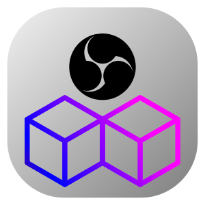

# OBS Toys

<p align="center">
  
</p>

<p align="center">
  <strong>A friendly app for installing OBS plugins on Linux.</strong>
</p>

<p align="center">
  <a href="LICENSE"></a>
  <a href="https://github.com/leoberbert/obs-toys/releases"></a>
  <a href="https://www.gtk.org/"></a>
  <a href="https://gnome.pages.gitlab.gnome.org/libadwaita/"></a>
  <a href="https://github.com/leoberbert/obs-toys"></a>
</p>

**OBS Toys** is a desktop app focused on making OBS Studio plugins easier to use on Linux. Instead of manually unpacking `.deb`, `.zip`, or `.tar.*` files and copying plugin assets into the correct OBS profile directories, OBS Toys handles that workflow in a cleaner GTK interface.

## Download and Run

Download the latest `OBS-Toys-x86_64.AppImage` from the [Releases](https://github.com/leoberbert/obs-toys/releases) page.

Then make it executable and run it:

```bash
chmod +x OBS-Toys-x86_64.AppImage
./OBS-Toys-x86_64.AppImage
```

If your browser saves the file in `~/Downloads`, for example:

```bash
cd ~/Downloads
chmod +x OBS-Toys-x86_64.AppImage
./OBS-Toys-x86_64.AppImage
```

Notes:

- AppImage files usually need `chmod +x` after downloading.
- OBS Studio must be installed on your system before using OBS Toys.
- If OBS is open during a plugin install, OBS Toys will ask you to close it first.
- OBS Toys currently targets the system-installed version of OBS Studio and does not support the Flatpak build yet.
- Some plugins depend on OBS libraries and runtime components provided by the system installation, which is why Flatpak support is not reliable at the moment.
- We are evaluating ways to make OBS Toys work for both system-installed OBS and Flatpak in the future, but for now only the native system installation is supported.

## Why OBS Toys

- **Built for OBS on Linux**: install plugins into `~/.config/obs-studio/plugins` without manual extraction steps.
- **Curated plugin catalog**: only plugins that make sense for this workflow should appear in the app.
- **Simple install and removal flow**: confirm, install, remove, and verify status in a straightforward UI.
- **Linux-native desktop experience**: GTK4 + libadwaita with a layout aligned to the Linux Toys ecosystem.
- **Multiple plugin sources**: supports both GitHub Releases and OBS Resources.

## Current Plugin Support

- `OBS Multi RTMP`
- `Aitum Stream Suite`
- `OBS Move Transition`
- `OBS Advanced Masks`
- `OBS Stroke Glow Shadow`
- `OBS Retro Effects`
- `OBS 3D Effect`
- `Composite Blur`
- `Source Clone`
- `Advanced Scene Switcher`

## What OBS Toys Does

- Detects whether OBS is installed on the system
- Shows a searchable plugin catalog
- Downloads release assets from GitHub and OBS Resources
- Extracts `.deb`, `.zip`, and `.tar.*` archives
- Copies plugin files into the correct OBS plugin directory
- Detects when a plugin is already installed
- Allows removing installed plugins from the same interface

## Run Locally

```bash
cd /home/leoberbert/github/leoberbert/obs-toys
PYTHONPATH=src python3 -m obs_toys
```

Editable install:

```bash
cd /home/leoberbert/github/leoberbert/obs-toys
python3 -m venv .venv
source .venv/bin/activate
pip install -e .
obs-toys
```

## Project Structure

- `src/obs_toys/ui.py`: GTK/libadwaita interface
- `src/obs_toys/catalog.py`: curated recipe loader
- `src/obs_toys/github.py`: GitHub Releases and OBS Resources asset resolver
- `src/obs_toys/installer.py`: download, extraction, and install logic
- `src/obs_toys/obs.py`: OBS path and installation status helpers
- `src/obs_toys/data/plugins.json`: plugin catalog
- `src/obs_toys/data/icons/`: project icons and UI assets

## Notes

- OBS Toys is intentionally curated. Not every OBS plugin published for Linux is guaranteed to work correctly out of the box.
- Some plugins come from GitHub Releases, while others are better discovered through OBS Resources.
- OBS Studio needs to be installed on the system before OBS Toys can install plugins.
- OBS Flatpak is not supported for now. The current plugin workflow targets `~/.config/obs-studio/plugins`, and some plugins require OBS dependencies that are available only in the system-installed environment.
- Universal support for both native OBS and Flatpak is something we may add later, but it is still under evaluation.
- The goal is to keep the list practical and reliable rather than simply large.

## Roadmap

- Add more validated OBS plugins
- Improve metadata and compatibility checks per plugin
- Add app icon integration for system installation
- Add package/install assets for broader distribution

## License

This project is licensed under the **GPL-3.0-or-later** license.
